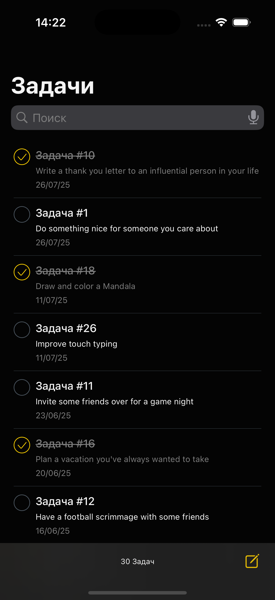
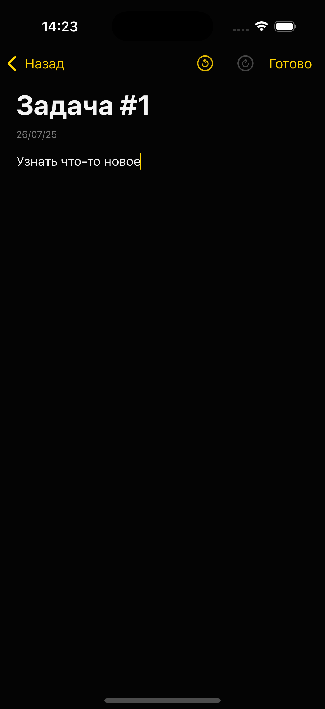
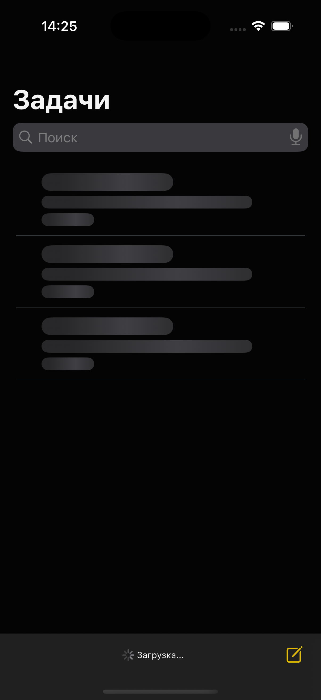
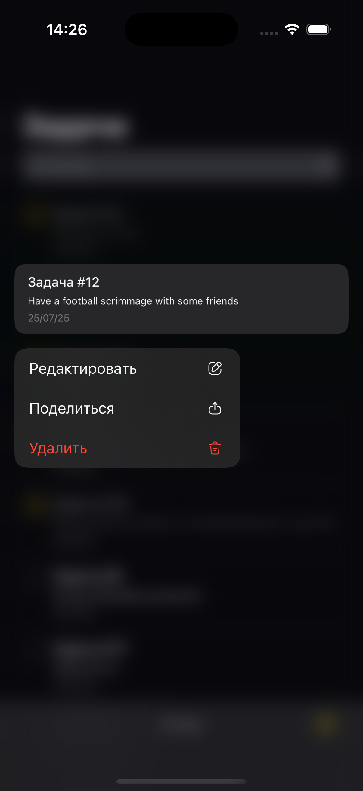
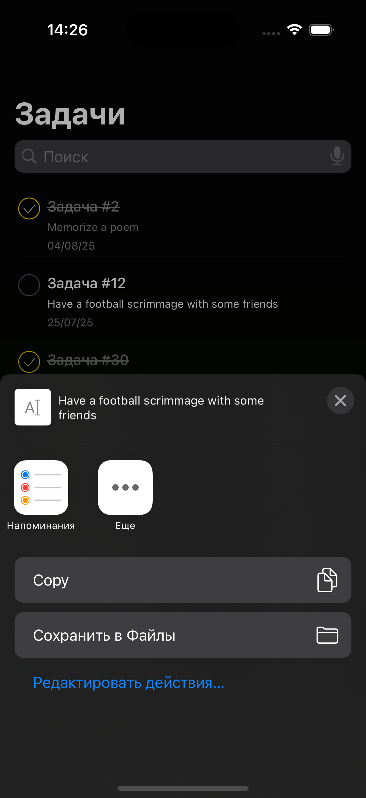
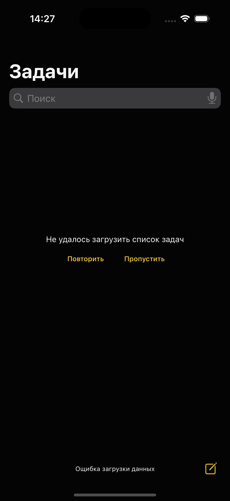

# 📱 TodoList App

iOS-приложение "TodoList" — это функциональный и аккуратно спроектированный список задач, реализованный с использованием **UIKit + VIPER**, **CoreData**, **Combine**, **URLSession** и **XCTest**.
Мой фокус: **архитектура**, **UX-детали**, **тестируемость**, и **гибкость расширения**.

---

## 🖼️ Скриншоты

| Главный экран <br/>*Список задач, поиск, shimmer* | Детальный экран <br/>*Просмотр задачи* | Редактор <br/>*Редактирование и история изменений* |
|:--:|:--:|:--:|
|  |  |  |

| Загрузка <br/>*Шиммер эффект и StatusView* | Контекстное меню <br/>*Удаление, Поделиться* | Поделиться задачей <br/>*UIActivityViewController* |
|  |  |  |

| Ошибка загрузки <br/>*Повторить или пропустить* | — | — |
|  | — | — |

---

## 🔧 Технологии

* `Swift`
* `UIKit + AutoLayout`
* `VIPER architecture`
* `CoreData`
* `Combine`
* `XCTest`
* `URLSession`
* `AVFoundation + Speech`
* `DiffableDataSource`
* `Custom shimmering cells`
* `Memento pattern`

---

## 🧩 Структура приложения

### 1. **Todo Feed**

Главный экран со списком задач:

* 🔍 **Поиск** с использованием `UISearchController`
* 🎙️ **Голосовой ввод** для поиска — `Speech` + `AVFoundation`
* 📦 **Diffable Data Source**
* ✨ **Шиммер эффект** в ячейках на время загрузки из сети
* 📤 **Поделиться задачей**
* 🗑️ **Удаление задач**
* 🍏 **Context menu** с actions
* 🔃 **Обработка загрузки при первом запуске**
* 📉 **StatusView** с blur-фоном — отображает статус загрузки / количество задач

---

### 2. **Todo Detail**

Экран просмотра задачи:

* 📝 Отображает `todo`
* 🔗 Переход с главного экрана

---

### 3. **Todo Editor**

Редактирование и создание задач:

* ✏️ Интерфейс редактирования визуально идентичен экрану просмотра
* ♻️ **История изменений** с `Memento` — можно отменять и повторять изменения (как в Notes)
* 📦 Данные сохраняются или обновляются при выходе, если валидны
* ⌨️ **Обработка клавиатуры** для UX-комфорта

---

## 💾 Работа с данными

* 🔗 При первом запуске данные загружаются через `URLSession`, сохраняются в `CoreData`
* ⚠️ При ошибке — предлагается `Повторить` или `Пропустить` загрузку
* ✅ Локальное хранилище работает независимо

---

## 🧪 Тесты

Покрытие ключевых компонентов:

* `LocalTodoRepository` (CoreData)
* `TodoCaretaker` (Memento logic)
* `TodoEditorInteractor`
* `TodoListInteractor`

---

## 📥 Установка

```
git clone https://github.com/gibbonch/TodoList.git
cd TodoList
open TodoList.xcodeproj
```

* Deployment target: iOS 13+
